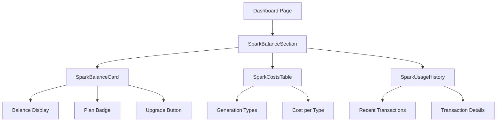
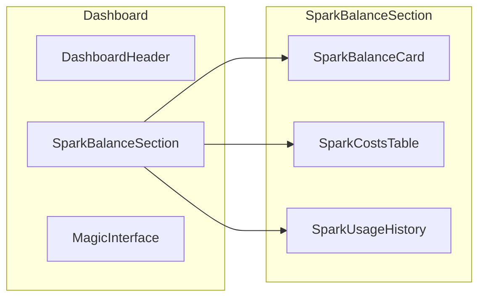
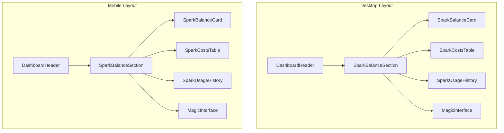
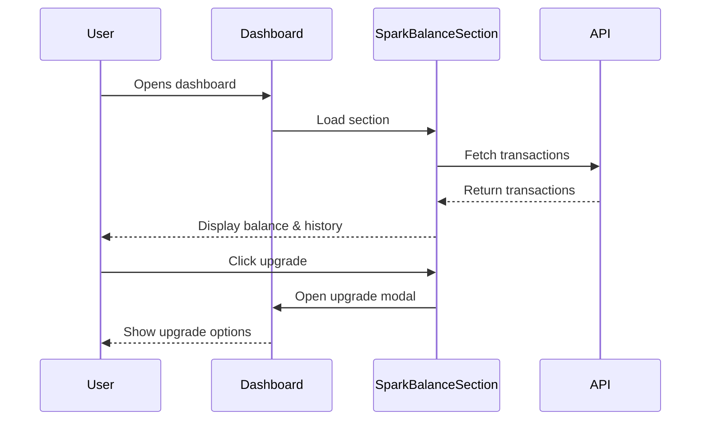

# Dashboard Spark Balance Display Plan

## Overview
Add a prominent spark balance display section in the dashboard to help users control their spending. The display will be strategically positioned above the MagicInterface component.

## Current State
- [`DashboardHeader.tsx`](src/components/dashboard/DashboardHeader.tsx) has a small SparkBalance component in the header
- [`SparkBalance.tsx`](src/components/sparks/SparkBalance.tsx) has variants: default, minimal, card
- Dashboard page structure is simple with just MagicInterface

## Design Goals
1. **Visibility**: Make spark balance immediately visible when entering dashboard
2. **Clarity**: Show current balance, plan, and costs in one place
3. **Actionable**: Provide quick access to upgrade when needed
4. **Consistent**: Use ManyLabs design system (vidro fosco + monospaced fonts)

## Component Architecture



## Layout Structure



## Component Specifications

### 1. SparkBalanceCard
**Purpose**: Display current spark balance prominently

**Features**:
- Large spark balance number with icon
- Plan badge (FREE, LITE, PRO, AGENCY, DEV)
- Monthly spark allowance (for paid plans)
- Low balance warning (< 50 sparks)
- Quick upgrade button

**Props**:
```typescript
interface SparkBalanceCardProps {
  className?: string;
  onUpgrade?: () => void;
}
```

**Visual Design**:
- Glass morphism background (vidro fosco)
- Gradient border
- Large spark icon (yellow)
- Monospaced font for numbers
- Responsive: full width on mobile, compact on desktop

### 2. SparkCostsTable
**Purpose**: Show generation costs for reference

**Features**:
- Table of generation types and costs
- First generation cost
- Regeneration cost
- Free regeneration indicator
- Plan availability indicators

**Props**:
```typescript
interface SparkCostsTableProps {
  className?: string;
  currentPlan?: UserPlan;
}
```

**Visual Design**:
- Compact table with glass background
- Color-coded availability (green = available, gray = locked)
- Spark icons for costs
- Monospaced font for numbers

### 3. SparkUsageHistory
**Purpose**: Show recent spark transactions

**Features**:
- List of recent transactions (last 5-10)
- Transaction type (debit/credit)
- Amount
- Description
- Timestamp
- View all transactions link

**Props**:
```typescript
interface SparkUsageHistoryProps {
  className?: string;
  limit?: number;
  onViewAll?: () => void;
}
```

**Visual Design**:
- Scrollable list
- Color-coded (red = debit, green = credit)
- Relative timestamps (e.g., "2 hours ago")
- Glass background

## Dashboard Layout



## Implementation Steps

### Step 1: Create SparkBalanceCard Component
- File: `src/components/sparks/SparkBalanceCard.tsx`
- Use existing SparkBalance component as base
- Add plan information display
- Add upgrade button
- Add low balance warning

### Step 2: Create SparkCostsTable Component
- File: `src/components/sparks/SparkCostsTable.tsx`
- Import SPARK_COSTS from config
- Import PLAN_CONFIGS from plans
- Display costs with availability indicators
- Use ManyLabs styling

### Step 3: Create SparkUsageHistory Component
- File: `src/components/sparks/SparkUsageHistory.tsx`
- Fetch recent transactions from Supabase
- Display transaction list
- Add view all functionality
- Use ManyLabs styling

### Step 4: Create SparkBalanceSection Component
- File: `src/components/sparks/SparkBalanceSection.tsx`
- Combine all three components
- Handle responsive layout
- Add section header

### Step 5: Integrate into Dashboard
- Modify `src/app/dashboard/page.tsx`
- Add SparkBalanceSection above MagicInterface
- Handle upgrade modal trigger
- Ensure proper spacing

### Step 6: Add Responsive Design
- Mobile: Stack components vertically
- Tablet: 2-column layout
- Desktop: 3-column layout or horizontal cards

### Step 7: Test Functionality
- Test balance display
- Test upgrade button
- Test cost table accuracy
- Test transaction history
- Test responsive behavior

## File Structure

```
src/components/sparks/
├── SparkBalance.tsx (existing)
├── SparkBalanceCard.tsx (new)
├── SparkCostsTable.tsx (new)
├── SparkUsageHistory.tsx (new)
├── SparkBalanceSection.tsx (new)
├── UpgradeModal.tsx (existing)
├── RegenerationBadge.tsx (existing)
├── RegenerationLimitModal.tsx (existing)
└── LockedFeature.tsx (existing)
```

## Design System Integration

### Colors
- Primary: Blue (#00B4FF)
- Spark: Yellow (#FBBF24)
- Warning: Orange (#F97316)
- Success: Green (#22C55E)
- Background: Gray (#111827)
- Glass: rgba(17, 24, 39, 0.8)

### Typography
- Numbers: Monospace font
- Labels: Sans-serif font
- Headings: Bold, larger size

### Effects
- Glass morphism: backdrop-blur-md
- Gradient borders
- Subtle shadows
- Hover effects

## API Requirements

### Fetch Recent Transactions
```typescript
// New API route: /api/sparks/transactions
GET /api/sparks/transactions
Response: {
  transactions: SparkTransaction[]
}
```

### SparkTransaction Type
```typescript
interface SparkTransaction {
  id: string;
  user_id: string;
  amount: number;
  type: 'credit' | 'debit';
  description: string;
  created_at: string;
}
```

## User Flow



## Success Criteria

1. ✅ Spark balance is prominently displayed in dashboard
2. ✅ User can see current plan and spark allowance
3. ✅ User can reference generation costs
4. ✅ User can see recent spark usage
5. ✅ Low balance warning appears when needed
6. ✅ Upgrade button is easily accessible
7. ✅ Design is consistent with ManyLabs system
8. ✅ Responsive on all screen sizes
9. ✅ Performance is optimal (fast loading)
10. ✅ Accessibility is maintained (ARIA labels, keyboard nav)

## Future Enhancements

1. Spark usage charts/graphs
2. Monthly spending reports
3. Spark purchase flow integration
4. Transaction filtering and search
5. Export transaction history
6. Spark usage predictions
7. Plan comparison modal
8. Quick spark purchase buttons
